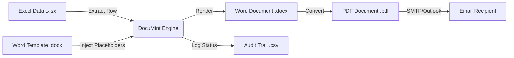

# 🍃 DocuMint
> **The Universal Document Orchestration Engine.**  
> *Batch Generate. Pixel-Perfect Convert. Secure Distribute.*

<div align="center">

[](https://opensource.org/licenses/MIT)
[](https://www.python.org/)
[]()
[]()
[](http://makeapullrequest.com)

[**Download Latest Version**](https://github.com/Z-root-X/DocuMint/raw/master/DocuMint_Portable.zip) • [**Read The Docs**](docs/USER_GUIDE.md)

</div>

---

## 🏗️ Architecture

DocuMint is not just a script; it's a **pipeline**. It parses structured data, injects it into templates, renders high-fidelity documents, and dispatches them via secure channels.



---

## 🚀 Why DocuMint?

Stop doing manual mail merge. DocuMint brings **Engineering Standards** to document workflows.

| Feature | ❌ Manual Way | ✅ DocuMint Way |
| :--- | :--- | :--- |
| **Speed** | 5 mins per document | **1000+ docs per hour** |
| **Accuracy** | Prone to copy-paste errors | **Validation Engine guarantees 100% match** |
| **Distribution** | Manually attaching files | **Auto-email via SMTP or Outlook** |
| **Reliability** | Crashes on large batches | **Retry Logic & Rate Limiting built-in** |

---

## ⚡ Key Features

### � Safe & Secure
*   **Pre-Flight Validation**: Our engine scans every `<Tag>` in your template before processing a single row. If your Excel file is missing a column, we stop you *before* you error out.
*   **Secure SMTP**: Supports SSL/TLS encryption for Gmail, Office365, and enterprise mail servers.

### 🎨 Logic-Driven Design
*   **Dynamic Filenames**: Generate files like `Contract_2024_JohnDoe.pdf` automatically using data tags.
*   **Smart Throttling**: Configurable delays (e.g., 2s) to prevent your email account from being flagged as spam.
*   **Cross-Platform Core**: While PDF conversion uses Word (Windows), the core logic is pure Python and future-proof.

### 💻 Modern UX
> "A tool is only as good as its interface."

*   **Dark Mode**: Standard.
*   **Responsive**: Resizes to your workflow.
*   **Context Aware**: Built-in Tooltips explain complex settings like "SMTP Host" or "App Passwords".

---

## 🛠️ Quick Start

### 1. Installation

**Stand-alone (Recommended)**  
[Download `DocuMint_Portable.zip`](https://github.com/Z-root-X/DocuMint/raw/master/DocuMint_Portable.zip), unzip it, and run `DocuMint.exe`. No install required.

**Developer Setup**
```bash
git clone https://github.com/Z-root-X/DocuMint.git
cd DocuMint
pip install .
python src/main.py
```

### 2. Workflow
1.  **Format**: In Word, generic text becomes `<Name>`, `<Date>`, `<ID>`.
2.  **Data**: In Excel, headers must match: `Name`, `Date`, `ID`.
3.  **Validate**: Use the app's **"Validate Files"** button to cross-check.
4.  **Execute**: Sit back as DocuMint generates PDFs and fires emails.

---

## 🌍 Real World Use Cases

*   **🎓 Education**: Send Admit Cards, Grade Sheets, and Certificates to 10,000 students.
*   **🏢 Enterprise**: Distribute personalized NDAs, Offer Letters, or Monthly Invoices.
*   **🎉 Events**: Issue QR-code tickets (embedded in Word) to registered attendees.

---

## 👨‍💻 Creator & Maintainer

<table align="center">
    <tr>
        <td align="center">
            <a href="https://zihadhasan.web.app">
            <sub><b>Zihad Hasan</b></sub></a>
            <br />
            🚀 <i>Full Stack Engineer</i>
        </td>
    </tr>
</table>

> "I build tools that respect your time."

[**🌐 Visit Portfolio**](https://zihadhasan.web.app)

---

## 🤝 Contributing

We believe in Open Source. If you want to add `LibreOffice` support or a Web Interface:
1.  Fork it.
2.  Create your feature branch (`git checkout -b feature/AmazingFeature`).
3.  Commit your changes.
4.  Open a Pull Request.

See [CONTRIBUTING.md](CONTRIBUTING.md) for style guides.

---

## 📄 License

This project is licensed under the **MIT License**. Free for personal and commercial use.